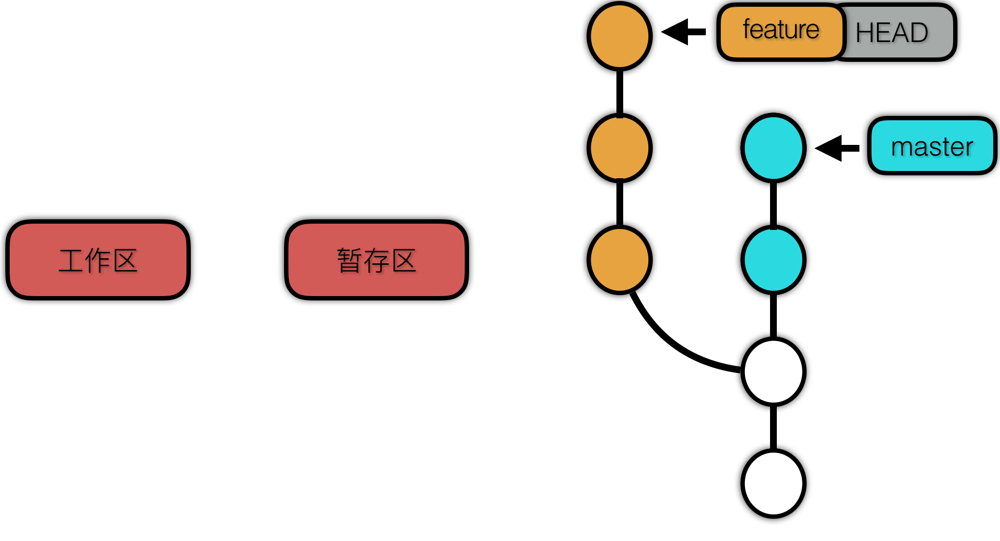

## 从HEAD指针理解git和它的回退操作
### 从HEAD说起


    上图为是一张git分支示例图，图中HEAD指向feature分支，说明当前所在分支为feature，简单来说就是：`你现在在哪儿，HEAD 就指向哪儿，所以 Git 才知道你在那儿`。但是HEAD指向的不一定是分支，也可能指向一个commit。这个应该怎么理解呢？
    
参考[what-is-head-in-git](http://stackoverflow.com/questions/2304087/what-is-head-in-git )，我们可以查看.git/HEAD 文件，它保存了当前的分支

```
    cat .git/HEAD
    =>ref: refs/heads/master
```

这里HEAD文件即是我们平时所说的HEAD指针，它存储了一个（refs）分支路径，这就是它指向分支的方式。继续查看文件的内容。

```
cat .git/refs/heads/master
=>f7d96e3977694657b233fffc45ef6be924a69a02
```
可以看到分支存储了一个字符串的值，我们使用 cat-file 命令继续查看，内容如下。

```
git cat-file -p f7d96e3977694657b233fffc45ef6be924a69a02
=>tree 0287e77fcc9e3d377f0e6f0df4d39ecc2d8bf9b7
=>parent 58fedb2f921c76350fb13d990a8db8088da628d2
=>author 火禹 <hongyu.rhy@antfin.com> 1511788758 +0800
=>committer 火禹 <hongyu.rhy@antfin.com> 1511788758 +0800

=>for test
```
    
这个字符串的值是什么呢 ，cat-file查看的内容是什么呢？我们有必要简单理解下git的原理

###git原理
众所周知，git需要存储对每次提交的版本进行存储，为了节省存储的空间，git只会将同样的内容文件只保存了一份。这就引入了Sha-1算法。
可以使用git命令计算文件的 sha-1 值。

```
echo 'hello world' | git hash-object --stdin
=>3b18e512dba79e4c8300dd08aeb37f8e728b8dad
```

将文件的sha-1值作为文件的唯一 id，每个版本存储的只是物理文件的快照也就是通过sha-1计算出来的hash作为的索引值。


git存储的文件结构抽象为4种类型：blob、tree、commit、tag。

1. blob：用来存放项目文件的内容，但是不包括文件的路径、名字、格式等其它描述信息。项目的任意文件的任意版本都是以blob的形式存放的。

2. tree：ree 用来表示目录。我们知道项目就是一个目录，目录中有文件、有子目录。因此 tree 中有 blob、子tree，且都是使用 sha-1值引用的。这是与目录对应的。从顶层的 tree 纵览整个树状的结构，叶子结点就是blob，表示文件的内容，非叶子结点表示项目的目录，顶层的 tree 对象就代表了当前项目的快照。

3. commit: 表示一次提交，有parent字段，用来引用父提交。指向了一个顶层 tree，表示了项目的快照，还有一些其它的信息，比如上一个提交，committer、author、message 等信息。

4. Tag： Tag非常像一个commit对象——包含一个标签，一组数据，一个消息和一个指针。最主要的区别就是 Tag 对象指向一个 commit 而不是一个 tree。它就像是一个分支引用，但是不会变化——永远指向同一个 commit，仅仅是提供一个更加友好的名字。

更详细的信息点击这里[Git-对象](https://git-scm.com/book/zh/v1/Git-%E5%86%85%E9%83%A8%E5%8E%9F%E7%90%86-Git-%E5%AF%B9%E8%B1%A1)查看

回过头来，我们可以看出cat-file得到的便是一个commit对象，除了标明提交信息以外，同时包含了tree对象的引用，和上一次的commit对象的引用。而.git/refs/heads/master中存储了commit对象的hash值。

```
git cat-file -p f7d96e3977694657b233fffc45ef6be924a69a02
//tree对象
=>tree 0287e77fcc9e3d377f0e6f0df4d39ecc2d8bf9b7
//上一次commit对象
=>parent 58fedb2f921c76350fb13d990a8db8088da628d2
=>author 火禹 <hongyu.rhy@antfin.com> 1511788758 +0800
=>committer 火禹 <hongyu.rhy@antfin.com> 1511788758 +0800

=>for test
```

查看tree对象。可以看到显示的是最近一次提交的*完整*的项目文件结构的快照

```
git cat-file -p 0287e77fcc9e3d377f0e6f0df4d39ecc2d8bf9b7
=>100644 blob 5ab9270b2a72afa8ebb55ba5cee27ed45ac56ac4    README.md
=>040000 tree 55e957c008470f1ca265e228db91deea85cbf28b    browser
=>100644 blob 8ee97644746f6cd4176f61ddbf7dfc789416e67b    lala
=>040000 tree ca199d18337591bebefeda1d996c787ed6b18bc7    node
=>040000 tree 32c9de5eba93fed0ea9d69bd6a4761074f844c1f    versionManage
```

查看parent。显示的是上一次的commit对象。

```
git cat-file -p 58fedb2f921c76350fb13d990a8db8088da628d2
=>tree c09ce8d920ed5ed2b2e38f760199a16ac07026d3
parent 4bfc2d805f8980bc7ebd861c094445ecbd5de561
=>author 火禹 <hongyu.rhy@antfin.com> 1511788736 +0800
=>committer 火禹 <hongyu.rhy@antfin.com> 1511788736 +0800

=> frist commit
```
看到这里就豁然开朗，那么同学们开始划重点了，我的理解是: _HEAD指向的本就是commit，commit是体现当前提交的一个完整项目结构快照，同时包含一个指向上一次提交的指针，就像链表一样一环扣一环最终形成一条完成的commit线路，这就是分支！HEAD指向的既是commit亦是branch。_

### 让我们换一种方式理解checkout
git checkout 这个命令有三个不同的作用：检出文件、检出提交和检出分支。从本质上来理解其实是一样的，他们做了一件事情就是就把HEAD指针在提交节点上移动，只是移动的维度不同而已。

切换branch = 切换到一个不关联的commit节点

```
git checkout master
```
切换commit = 切换到统一链路的commit节点，这会使你处在游离的 HEAD 的状态，我们可以理解为HEAD指向了一个虚拟的commit节点，这是从安全存储的角度考虑，检出之前的提交是一个只读操作。在查看旧版本的时候绝不会损坏你的仓库。

```
git checkout <commit>
```
切换file = 切换（检出）到commit节点中具体的blob对象。

```
git checkout <commit> <file>
```
git checkout 是一种便捷的方式，来将保存的快照「加载」到你的开发机器上去。

### 其它的回滚修改
    
#### git reset

通过下面的命令来理解下。

从缓存区移除特定文件，但不改变工作目录。它会取消这个文件的缓存，而不覆盖任何更改。

```
    git reset <file>
```

重设缓冲区，但工作目录不变。它会取消 所有 文件的缓存，而不会覆盖任何修改，给你了一个重设缓存快照的机会。

```
    git reset = git reset HEAD
```

将当前HEAD指向 <commit>，这会使缓存区重设到这个提交，但不改变工作目录。所有 <commit> 之后的更改会保留在工作目录中，这允许你用更干净、原子性的快照重新提交项目历史。

```
    git reset <commit> 
```

重设缓冲区和工作目录，匹配最近的一次提交。除了取消缓存之外，--hard 标记告诉 Git 还要重写所有工作目录中的更改。换句话说：它清除了所有未提交的更改，所以在使用前确定你想扔掉你所有本地的开发。


```
    git reset --hard = git reset HEAD --hard
```

将当前HEAD指向 <commit>，将缓存区和工作目录都重设到这个提交。它不仅清除了未提交的更改，同时还清除了 <commit> 之后的所有提交。

```
    git reset --hard <commit>
```

可以看到除去reset <file>，实质其它操作都是reset到指定commit节点上来达到回滚效果。

通过上文的解释，git reset HEAD的操作就很好理解了，HEAD指向当前所在commit，而HEAD\^还是HEAD~100都只是快速选择版本的语法糖而已。

另外只需要留意--hard标记，没有 --hard 标记时 git reset 通过取消缓存或取消一系列的提交，然后重新构建提交来清理仓库。而加上 --hard 标记对于作了大死之后想要重头再来尤其方便。

需要注意：**git reset 它应该只被用于 本地 修改——你永远不应该重设和其他开发者共享的快照。因为你用 git reset 来重设更改时(提交不再被任何引用或引用日志所引用)，我们无法获得原来的样子——这个撤销是永远的。使用这个工具的时候务必要小心，因为这是少数几个可能会造成工作丢失的命令之一。**

#### git revert

git revert 命令用来撤销一个已经提交的快照。但是，它是通过搞清楚如何撤销这个提交引入的更改，然后在最后加上一个撤销了更改的 新 提交，而不是从项目历史中移除这个提交。这避免了Git丢失项目历史，这一点对于你的版本历史和协作的可靠性来说是很重要的。

生成一个撤消了 <commit> 引入的修改的新提交，然后应用到当前分支。

```
    git revert <commit>
```

#### 讨论
撤销(revert)被设计为撤销公开的提交的安全方式，git reset被设计为重设本地更改。因为两个命令的目的不同，它们的实现也不一样：重设完全地移除了一堆更改，而撤销保留了原来的更改，用一个新的提交来实现撤销。

平时开发中，建议千万不要重设公共历史，当有 <commit> 之后的提交被推送到公共仓库后，你绝不应该使用 git reset。发布一个提交之后，你必须假设其他开发者会依赖于它。移除一个其他团队成员在上面继续开发的提交在协作时会引发严重的问题。

另外再说下clean这个命令，git clean 命令经常和 git reset --hard 一起使用。reset 只影响被跟踪的文件，所以还需要一个单独的命令来清理未被跟踪的文件。这个两个命令相结合，你就可以将工作目录回到之前特定提交时的状态。如果你在本地仓库中作死之后想要毁尸灭迹，git reset --hard 和 git clean -f 是你最好的选择。运行这两个命令使工作目录和最近的提交相匹配，让你在干净的状态下继续工作。

### 总结

理解了git的相关本质之后，再去学习它的命令语法，便更能理解它设计的初衷，从而明确有效地使用。

当然平时开发中，其实并不需要死记每一个命令，文章旨在表述如何更好地理解git中的命令，现如今已有很多方便的git工具（包括一些ide自带的插件）可以提高我们的工作效率，笔者推荐sourcetree，一个相当强大的GUI管理版本仓库。

以上就是全部，祝好~


    
    
    


